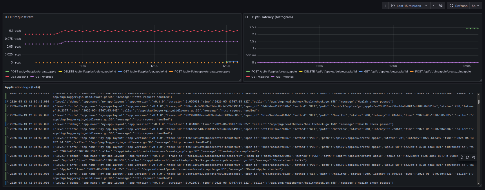

# go-service-layout

## Стек
* Go 1.26
* PostgreSQL

## Описание
Сервис шаблон с современными практиками.
* Чистая архитектура
* graceful shutdown
* health
* мониторинг в стеке: Prometheus, Loki, Grafana, Promtail (для сбора логов)  

## Запуск

Локальный запуск:
1) Команда ```cp .env.template .env```
2) Команда ```make up```

## Графана мониторинг  
Источник данных: prometheus, loki    
скриншот  

